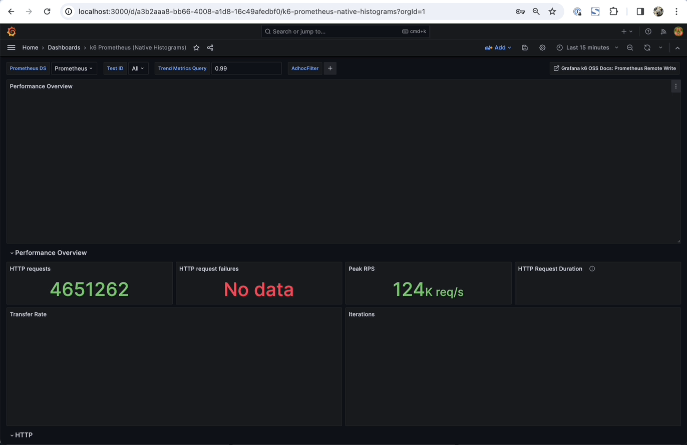

Kong Gateway Performance Benchmark
==================================

Scripts to deploy:
- k8s cluster on EKS
- Kong Gateway with Ingress Controller (CE or EE)
- A test upstream ([go-bench-suite](https://github.com/asoorm/go-bench-suite))
- [k6 operator](https://github.com/grafana/k6-operator)

---

## Quick Start Guide

This section provides a complete walkthrough for deploying the benchmark environment, running tests, and cleaning up resources.

### Resource Requirements

The EKS cluster uses dedicated node groups for workload isolation:

| Node Group | Instance Type | vCPU | Memory | Count (min/desired/max) | Purpose |
|------------|---------------|------|--------|-------------------------|---------|
| **loadgen** | c5.metal | 96 | 192 GB | 1/1/3 | k6 load generators |
| **kong** | c5.4xlarge | 16 | 32 GB | 1/1/2 | Kong Gateway |
| **support** | c5.2xlarge | 8 | 16 GB | 1/1/2 | Redis, Prometheus, Grafana, mocks |
| **litellm** (optional) | c5.4xlarge | 16 | 32 GB | 1/1/2 | LiteLLM proxy for comparison |

**Estimated costs (us-west-2 on-demand pricing):**

| Configuration | Nodes | Total vCPU | Total Memory | Est. Cost/Hour |
|---------------|-------|------------|--------------|----------------|
| Default (no LiteLLM) | 3 | 120 | 240 GB | ~$6.50 |
| With LiteLLM | 4 | 136 | 272 GB | ~$7.90 |

> **Cost optimization**: The c5.metal instance (~$4.08/hr) is the largest cost. For lighter workloads, override with `terraform apply -var="instance_type=c5.4xlarge"` to reduce costs to ~$2.80/hr.

### Step 1: Create the EKS Cluster

```bash
# Authenticate with AWS
aws sso login

# Create the cluster (takes 15-20 minutes)
cd provision-eks-cluster
terraform init -input=false
terraform plan -out eks.plan -input=false
terraform apply -auto-approve eks.plan

# Configure kubectl
aws eks --region $(terraform output -raw region) update-kubeconfig \
    --name $(terraform output -raw cluster_name)

# Verify nodes are ready
kubectl get nodes
```

**Optional**: Enable LiteLLM node group for gateway comparison benchmarks:
```bash
terraform apply -var="enable_litellm_node_group=true"
```

### Step 2: Deploy Kong and Supporting Services

```bash
# For Kong Enterprise (recommended for AI Gateway benchmarks)
export TF_VAR_kong_enterprise=true
export TF_VAR_kong_repository=kong/kong-ai-gateway-dev
export TF_VAR_kong_version=ai-2.0.0-rc.2
export TF_VAR_kong_effective_semver=2.0.0   # non-semver dev tag needs this

# Deploy all services
cd ../deploy-k8s-resources
terraform init -input=false
terraform plan -out deploy.plan -input=false
terraform apply -auto-approve deploy.plan

# Apply AI benchmark configuration
kubectl apply -f kong_helm/ai-benchmark-suite.yaml
```

### Step 3: Run Benchmark Tests

**Single scenario test:**
```bash
cd k6_tests
bash run_ai_benchmark.sh token-chat-openai short 25 6m
```

**Full campaign with multiple VU levels:**
```bash
# Runs 5 VU levels × 3 repeats ≈ 1.75 hours
./run_stream_openai_campaign.sh 3 ./results/my-campaign
```

**Kong vs LiteLLM comparison (requires LiteLLM node group):**
```bash
kubectl apply -f ../kong_helm/litellm-deployment.yaml
./run_kong_vs_litellm_comparison.sh --eks --repeats 3
```

### Test Duration Estimates

| Test Type | Configuration | Estimated Duration |
|-----------|---------------|-------------------|
| Single scenario | 6m duration | ~7 minutes |
| Single campaign | 5 VU levels × 3 repeats | ~1.75 hours |
| Kong vs LiteLLM | 6 scenarios × 2 gateways × 3 repeats | ~4 hours |
| Full AI suite | 8 scenarios × 5 VU levels × 3 repeats | ~14 hours |

### Step 4: View Results

```bash
# Port-forward Grafana
kubectl port-forward svc/grafana 3000:3000 -n monitoring

# Open http://localhost:3000 and navigate to:
# - k6 Prometheus dashboard for real-time metrics
# - Kong dashboard for gateway metrics
```

Results are also saved to `./results/` directory with CSV exports.

### Step 5: Clean Up Resources

**⚠️ Important: Resources are NOT automatically released after tests complete.**

**Recommended cleanup order** (avoids AWS dependency issues):

```bash
# From repository root
aws sso login
./destroy_eks_benchmark.sh
```

Or manually:
```bash
# 1. Destroy Kubernetes resources first
cd deploy-k8s-resources
terraform destroy -auto-approve

# 2. Then destroy EKS cluster
cd ../provision-eks-cluster
terraform destroy -auto-approve
```

**Cost-saving alternatives** (if you need to pause but keep the cluster):

```bash
# Scale node groups to zero
aws eks update-nodegroup-config \
  --cluster-name kong-perf \
  --nodegroup-name loadgen \
  --scaling-config minSize=0,maxSize=3,desiredSize=0

aws eks update-nodegroup-config \
  --cluster-name kong-perf \
  --nodegroup-name kong \
  --scaling-config minSize=0,maxSize=2,desiredSize=0

aws eks update-nodegroup-config \
  --cluster-name kong-perf \
  --nodegroup-name support \
  --scaling-config minSize=0,maxSize=2,desiredSize=0
```

This reduces EC2 costs to near zero while preserving the cluster configuration.

---

## Detailed Setup Instructions

Run `provision-eks-cluster` terraform scripts first to create the EKS cluster

First, you need to make sure you have proper authentication to interact with [AWS](https://docs.aws.amazon.com/cli/latest/userguide/sso-configure-profile-token.html)
```
aws sso login
```
Then run the `terraform` command to create the cluster, it could take around 15-20 minutes to create the EKS cluster, so be patient. 
```
terraform init -input=false  
terraform plan -out YOUR_PLAN_NAME.plan -input=false
terraform apply -auto-approve YOUR_PLAN_NAME.plan
```

Then run:
```
aws eks --region $(terraform output -raw region) update-kubeconfig \
    --name $(terraform output -raw cluster_name)
```

Verify cluster is running:
```
$ kubectl get nodes
NAME                                       STATUS   ROLES    AGE   VERSION
ip-10-0-2-83.us-west-2.compute.internal    Ready    <none>   25m   v1.27.7-eks-e71965b
ip-10-0-3-172.us-west-2.compute.internal   Ready    <none>   25m   v1.27.7-eks-e71965b
ip-10-0-3-91.us-west-2.compute.internal    Ready    <none>   25m   v1.27.7-eks-e71965b
```

Next, you can start the deployment of kong and all the other services. Please note, if you want to test [Kong Enterprise](https://konghq.com/products/kong-enterprise), there are some extra setup required before you run the terraform scripts in `deploy-k8s-resources`

Extra configurations for [Kong Enterprise](https://konghq.com/products/kong-enterprise)
1. Update [license.json](https://github.com/Kong/kong-gateway-performance-benchmark/blob/main/deploy-k8s-resources/kong_helm/license.json) with a valid `license.json` to start Kong Enterprise. If you don't have one, please reach out to [team](mailto:bizdev@konghq.com?subject=[GitHub]%20Source%20Han%20Sans) for a temporary testing license.
2. Add terraform variables
```
export TF_VAR_kong_enterprise=true
export TF_VAR_kong_repository=kong/kong-ai-gateway-dev
export TF_VAR_kong_version=ai-2.0.0-rc.2
export TF_VAR_kong_effective_semver=2.0.0
```
3. If you are testing non-release kong enterprise image, you also need to set `kong_effective_semver` along with other variables like 
```
export TF_VAR_kong_enterprise=true
export TF_VAR_kong_repository=kong/kong-gateway-dev
export TF_VAR_kong_version=3.6-test-image
export TF_VAR_kong_effective_semver=3.6
```

Run `deploy-k8s-resources` terraform scripts to start the deployment
```
terraform init -input=false  
terraform plan -out YOUR_PLAN_NAME.plan -input=false
terraform apply -auto-approve YOUR_PLAN_NAME.plan
```

If you created the EKS cluster from a Terraform workspace, make sure `deploy-k8s-resources` reads that same `provision-eks-cluster` state. You can either use the same workspace name in both directories or set it explicitly before planning:
```
export TF_VAR_eks_state_workspace=YOUR_EKS_WORKSPACE
```

For example, if the cluster was created from the `metal4` workspace:
```
export TF_VAR_eks_state_workspace=metal4
terraform plan -out YOUR_PLAN_NAME.plan -input=false
```

On EKS, Prometheus and Redis need a usable storage class for their PVCs. This repo now requests `gp2` explicitly so those Helm releases do not depend on the cluster having a default `StorageClass`.

For longer-running performance work, the repo now uses a **role-based node topology** instead of relying on the Kubernetes scheduler to pack workloads wherever they fit.

Default intended placement:

- **loadgen node group**: k6 operator and k6 test pods
- **kong node group**: Kong data plane / ingress controller pods
- **support node group**: Redis, Prometheus, Grafana, metrics-server, mock upstream services, and cluster add-ons that do not tolerate the dedicated benchmark taints

This is intentional. It improves result quality because the load generator, the gateway under test, and supporting services stop competing for the same node's CPU and memory.

After pulling these topology changes:

1. re-apply `provision-eks-cluster` so the node-group labels/taints and support node group exist
2. re-apply `deploy-k8s-resources` so Helm/Kubernetes workloads pick up the new placement rules

This does **not** change the logical benchmark flow. It changes where workloads run so the measurements are more trustworthy.

After all the pods are up and running, try to reach kong with endpoint like 
```
curl -i --insecure -X GET https://YOUR-AWS-ELB-ENDPOINT.REGION.elb.amazonaws.com/upstream/json/valid
```

The default setup is 1 service/route and no plugin enabled, to enable other kong configurations, you need to navigate to `deploy-k8s-resources/kong_helm` and apply the `.yaml` you need. 

There are also scripts in the `deploy-k8s-resources/kong_helm` folder that could help you generate more kong config data([service/route](https://github.com/Kong/kong-gateway-performance-benchmark/blob/main/deploy-k8s-resources/kong_helm/upstream-generator.sh), [consumers](https://github.com/Kong/kong-gateway-performance-benchmark/blob/main/deploy-k8s-resources/kong_helm/consumer-generator.sh), [basic-auth](https://github.com/Kong/kong-gateway-performance-benchmark/blob/main/deploy-k8s-resources/kong_helm/basic-auth-testuser-secret-generator.sh), [key-auth](https://github.com/Kong/kong-gateway-performance-benchmark/blob/main/deploy-k8s-resources/kong_helm/key-auth-testuser-secret-generator.sh)) you need. 

Here are some examples about how you can apply some of the kong configurations

Deploy other k8s resources:
```
kubectl apply -f prometheus-plugin.yaml -n kong
kubectl apply -f basic-auth-testuser-secret.yaml -n kong
kubectl apply -f key-auth-testuser-secret.yaml -n kong
kubectl apply -f consumer-testuser.yaml -n kong

# To enable basic-auth
kubectl apply -f basic-auth-plugin.yaml -n kong

# To enable key-auth
kubectl apply -f key-auth-plugin.yaml -n kong

```

If you want to run the tests, you can navigate to `deploy-k8s-resources/k6_tests` folder, and trigger the test with running the `run_k6_tests.sh` script. you can run `bash run_k6_tests.sh --help` to see what input is expected while running the script. An example of running the test would be: 
```
bash run_k6_tests.sh k6_tests_01.js 1 300 900s false false 
```

### AI Gateway phase 1 baseline

The repository now includes an initial **AI Gateway performance harness** for **Kong Enterprise** using the `ai-proxy-advanced` plugin.

Current scope:

- OpenAI-compatible **chat completions**
- deterministic in-cluster mock upstream
- single `/ai-chat` route
- k6 **constant-arrival-rate** workload
- lightweight infra snapshot helper for pod/node CPU and memory

This is a practical starting point for **Phase 0 bring-up** and **Phase 1 baseline** work. It lets the team validate that the full path works end-to-end before moving on to higher-rate runs, policy-overhead experiments, or more advanced AI workloads.

#### Why these changes were added

The goal of this baseline is to give the team a reproducible AI Gateway perf path without depending on an external model provider.

Why the harness uses a deterministic mock upstream:

- removes provider-side variability from the first baseline
- avoids external API keys and network dependency for basic validation
- returns a stable response body and `usage` payload so the k6 checks are simple and repeatable
- gives us a clean foundation to scale request rate and observe Kong CPU/memory behavior

#### What this harness can do today

- prove that `ai-proxy-advanced` is wired correctly
- smoke-test the `/ai-chat` route
- run a first non-streaming AI baseline
- start controlled rate-scaling experiments
- collect basic observability data during or after runs

#### What this harness does **not** do yet

- it is **not** a complete AI Gateway benchmark suite
- it does **not** cover SSE / streaming chat yet
- it does **not** model real provider latency or token streaming behavior
- it should not yet be treated as a definitive Kong saturation test without additional rate-scaling and better peak-time metric capture

#### Quick start

#### 1. Re-apply Terraform after pulling the changes

This updates:

- the k6 ConfigMap with `k6_ai_chat_baseline.js` and `chat-short.json`
- the deterministic mock upstream deployment/service in the `upstream` namespace

From `deploy-k8s-resources/`:

```bash
terraform apply -auto-approve YOUR_PLAN_NAME.plan
```

If you prefer, create a fresh plan before applying.

#### 2. Apply the AI plugin + route manifest

From the repository root:

```bash
kubectl apply -f deploy-k8s-resources/kong_helm/ai-proxy-advanced-chat-baseline.yaml
```

This creates:

- a namespaced `KongPlugin` for `ai-proxy-advanced`
- an ingress route at `/ai-chat`

#### 3. Smoke test the route

Replace `YOUR-AWS-ELB-ENDPOINT` with your Kong proxy endpoint:

```bash
curl --insecure -X POST "https://YOUR-AWS-ELB-ENDPOINT/ai-chat" \
  -H "content-type: application/json" \
  --data @deploy-k8s-resources/k6_tests/chat-short.json
```

Expected response characteristics:

- HTTP `200`
- `choices[0].message.content == "kong-benchmark-ok"`
- `usage.prompt_tokens`, `usage.completion_tokens`, and `usage.total_tokens` are present

> Note: in some environments the Terraform output may print the ELB as `http://...`, but the actual Kong proxy path behaves as HTTPS-first. For smoke tests, prefer `https://...` with `--insecure`.

#### 4. Run a small smoke test first

From `deploy-k8s-resources/k6_tests/`:

```bash
bash run_ai_chat_baseline.sh \
  https://kong-kong-proxy.kong.svc.cluster.local/ai-chat \
  2 \
  1m \
  5 \
  20
```

This verifies:

- the k6 job starts correctly
- the in-cluster route works
- the response body shape matches expectations
- Prometheus remote write and basic observability are alive

#### 5. Run the default Phase 1 A1 baseline

From `deploy-k8s-resources/k6_tests/`:

```bash
bash run_ai_chat_baseline.sh \
  https://kong-kong-proxy.kong.svc.cluster.local/ai-chat \
  25 \
  6m \
  50 \
  200
```

Argument order:

1. `K6_AI_CHAT_URL`
2. `K6_AI_RATE`
3. `K6_AI_DURATION`
4. `K6_AI_PRE_ALLOCATED_VUS`
5. `K6_AI_MAX_VUS`

#### 6. Capture infra metrics

From `deploy-k8s-resources/k6_tests/`:

```bash
bash extract_infra_metrics.sh
```

### AI benchmark suite v2

The benchmark harness now supports:

- static proxy comparison
- token-aware OpenAI chat
- OpenAI and Gemini streaming
- embeddings
- isolated **policy overhead** scenarios

Apply the benchmark route suites:

```bash
kubectl apply -f deploy-k8s-resources/kong_helm/ai-benchmark-suite.yaml
kubectl apply -f deploy-k8s-resources/kong_helm/ai-benchmark-policy-suite.yaml
```

Policy benchmark routes are additive and do not replace the existing proxy-only routes:

- `/bench/policy/auth/openai`
- `/bench/policy/rate-limit/openai`
- `/bench/policy/token-budget/openai`
- `/bench/policy/cache/openai`

Policy benchmark scenarios:

```bash
cd deploy-k8s-resources/k6_tests

bash run_ai_benchmark.sh policy-auth-openai short 25 6m
bash run_ai_benchmark.sh policy-rate-limit short 25 6m
bash run_ai_benchmark.sh policy-token-budget short 25 6m
bash run_ai_benchmark.sh policy-cache-hit short 25 6m
bash run_ai_benchmark.sh policy-cache-miss short 25 6m
```

Policy benchmark matrices:

```bash
bash run_ai_benchmark_matrix.sh v2-policy-smoke
bash run_ai_benchmark_matrix.sh v2-policy-core
```

### Destroy the benchmark environment

Destroy in the reverse order of creation: remove the Kubernetes/Helm resources first, then remove the EKS/VPC stack. If you destroy `provision-eks-cluster` first, AWS load balancers created by the Kong proxy service can still be attached to the VPC and Terraform will fail with `DependencyViolation` errors while deleting subnets or detaching the internet gateway.

From the repository root:

```bash
aws sso login
./destroy_eks_benchmark.sh --provision-workspace YOUR_EKS_WORKSPACE --deploy-workspace YOUR_DEPLOY_WORKSPACE
```

If both directories are already set to the right Terraform workspace, the flags are optional:

```bash
./destroy_eks_benchmark.sh
```

The helper script destroys `deploy-k8s-resources`, waits until AWS load balancers in the benchmark VPC are gone, and only then destroys `provision-eks-cluster`.

This prints a point-in-time snapshot of:

- pod CPU/memory in `kong`, `upstream`, and `k6`
- node metrics
- restart summaries for Kong, upstream, and k6 pods

For meaningful baseline comparison, capture metrics **during** the run, not only after completion.

#### Suggested first workflow

Recommended order for new users:

1. apply Terraform changes
2. apply the AI route/plugin manifest
3. confirm `/ai-chat` with the `curl` smoke test
4. run the tiny k6 smoke test
5. run the default Phase 1 A1 baseline
6. increase only the request rate for follow-up experiments (for example 50, 100, 200 RPS)

This order makes it much easier to diagnose problems than jumping straight to a large run.

#### Suggested next experiments

Once the default A1 baseline is working, useful next steps are:

- stepped-rate runs to find where latency or errors start to bend
- comparing runs with different mock response delays
- testing larger request/response payload sizes
- later, adding streaming/SSE scenarios

### AI benchmark suite v2

The repository now also includes a broader AI benchmark suite built around two upstream modes:

- **static mode** via **WireMock** for fixed-response proxy comparison
- **token-aware mode** via the **fake provider** for token throughput, embeddings, and streaming studies

Benchmark route families:

- `/bench/static/chat`
- `/bench/token/chat/openai`
- `/bench/token/stream/openai`
- `/bench/token/stream/gemini`
- `/bench/token/embeddings/openai`

Scenario runner:

```bash
cd deploy-k8s-resources/k6_tests
bash run_ai_benchmark.sh --help
```

Examples:

```bash
bash run_ai_benchmark.sh token-chat-openai short 25 6m
bash run_ai_benchmark.sh stream-openai short 30 6m
bash run_ai_benchmark.sh embeddings-openai short 40 6m
```

Matrix helper:

```bash
bash run_ai_benchmark_matrix.sh v1-core
```

The matrix helper prints the canonical scenario commands in order. Run them one at a time so results and logs stay easy to interpret.

Memory sampling helper:

```bash
bash sample_kong_worker_memory.sh 60 5
```

This emits per-sample worker RSS statistics from the running Kong pod and is intended to be used during streaming runs.

#### Files added for the AI baseline

- `deploy-k8s-resources/ai_upstream/server.js`
- `deploy-k8s-resources/k6_tests/k6_ai_chat_baseline.js`
- `deploy-k8s-resources/k6_tests/chat-short.json`
- `deploy-k8s-resources/k6_tests/k6-ai-chat-test.yaml`
- `deploy-k8s-resources/k6_tests/run_ai_chat_baseline.sh`
- `deploy-k8s-resources/k6_tests/extract_infra_metrics.sh`
- `deploy-k8s-resources/kong_helm/ai-proxy-advanced-chat-baseline.yaml`

#### Why the dedicated topology matters

For basic bring-up, it is acceptable if Kong, k6, Redis, and observability land on the same large node. For serious performance work, that topology becomes noisy:

- k6 can steal CPU and memory from Kong
- Prometheus/Grafana/Redis add background resource pressure
- mock upstream traffic can hide whether a bottleneck is in Kong or elsewhere

The updated scheduling rules address this by making placement explicit:

- **Kong** is pinned to the `kong` node role
- **k6** initializer/starter/runner pods are pinned to the `loadgen` node role
- **supporting services** are pinned to the `support` node role

That separation works because the loadgen and kong node groups are tainted by role, the support node group is labeled for support workloads, and every benchmark workload is configured with matching `nodeSelector` + `tolerations` where needed. In practice, that gives us:

- cleaner Kong CPU and memory measurements
- less accidental node-local contention
- more repeatable baselines across runs
- a topology that scales better for longer-term AI Gateway perf work

After triggering the k6 tests, you can check to see whether the k6 test is running by command like below:
```
kubectl get pods -n k6
NAME                                                 READY   STATUS      RESTARTS   AGE
k6-k6-operator-controller-manager-6b7f5b5647-bz9ml   2/2     Running     0          5d19h
k6-kong-1-f49x6                                      0/1     Running     0          118s
k6-kong-initializer-f5w5j                            0/1     Completed   0          2m1s
```

Please note, in our default setup for [k6](https://github.com/Kong/kong-gateway-performance-benchmark/blob/main/provision-eks-cluster/variables.tf) tooling, we are using [c5.metal](https://aws.amazon.com/ec2/instance-types/c5/), it might be too powerful/expensive for some users. We use it as default because `k6` is very resources demanding when running [high load performance tests](https://k6.io/docs/testing-guides/running-large-tests/#hardware-considerations). If you decided to use a less powerful machine for `k6`, you need to adjust the default setup of the `resources` required for [k6-test.yaml](https://github.com/Kong/kong-gateway-performance-benchmark/blob/main/deploy-k8s-resources/k6_tests/k6-test.yaml)


You can monitor the pod CPU/MEM metrics with [metrics-server](https://github.com/kubernetes-sigs/metrics-server) with command like 
```
kubectl top pod -n kong 
kubectl top pod -n k6
kubectl top pod -n observability
```

You can also view the metrics in realtime via grafana

First find the grafana pod via command like 
```
kubectl get pods -n observability 
NAME                                                 READY   STATUS    RESTARTS   AGE
grafana-6c9b96488c-2fvfm                             2/2     Running   0          26h
prometheus-alertmanager-0                            1/1     Running   0          26h
prometheus-kube-state-metrics-85596bfdb6-td55s       1/1     Running   0          26h
prometheus-prometheus-node-exporter-h74g2            1/1     Running   0          26h
prometheus-prometheus-node-exporter-qdbcf            1/1     Running   0          26h
prometheus-prometheus-node-exporter-r6zqr            1/1     Running   0          26h
prometheus-prometheus-pushgateway-79745d4495-5gb9h   1/1     Running   0          26h
prometheus-server-7c4d9755b5-nwht2                   2/2     Running   0          26h
```

Then portforward the grafana pod to your local with command like 
```
kubectl port-forward grafana-6c9b96488c-2fvfm 3000:3000 -n observability
```

Now you can load the grafana in your local browser with url like `http://localhost:3000/dashboards`

It will probably will ask you to login for the first time, the default username is `admin`, to find the password, use this command below and paste the output to the password field in your browser. 
```
kubectl get secret --namespace observability grafana -o jsonpath="{.data.admin-password}" | base64 --decode ; echo
```



## License
[Apache 2.0 License](https://github.com/Kong/kong-gateway-performance-benchmark/blob/main/LICENSE)
